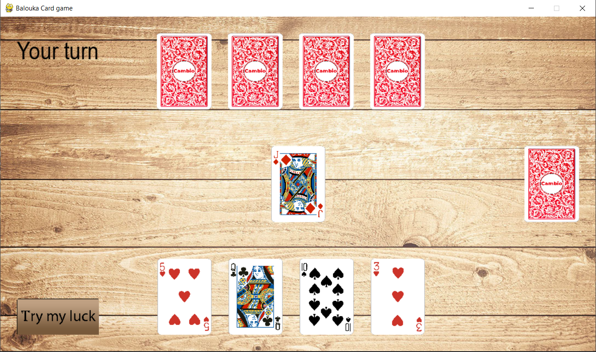

# Python Online Card Game




##  About this project
```bash
--- watch game running video.mp4 to see how the game runs ---

This project is an online card game (with 'Yaniv' rules).
In this project I mostly focused in the client-server communication and the modularity  of the project
so there is minimal user interface and graphics.

---True to march 2022 this game's server runs on Linode external server so the game can be played from
any machine But it is there for limited time, so if you tried to play and you receive an error -
you can only play on your local Lan (change the server_ip in client.py to your local ip)--- 
```
##  Features
```bash
1. Server side using Sockets
2. client side also using sockets
3. Game-logic and rules
4. User's Gui using pygame 
```


### Setup & Installation

Make sure you have Python version of 3.9 or above installed.  
use git clone to clone this repository


```bash
pip install -r requirements.txt
```

### Running The App

```bash
To play online (If Linode server still runs) - player_gui.py

To play on local Network, first run my_server.py and than python player_gui.py
```
